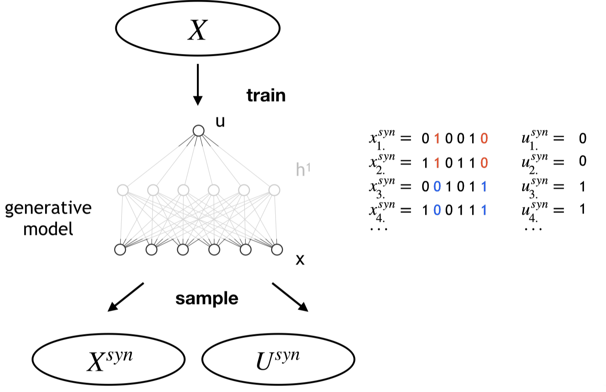
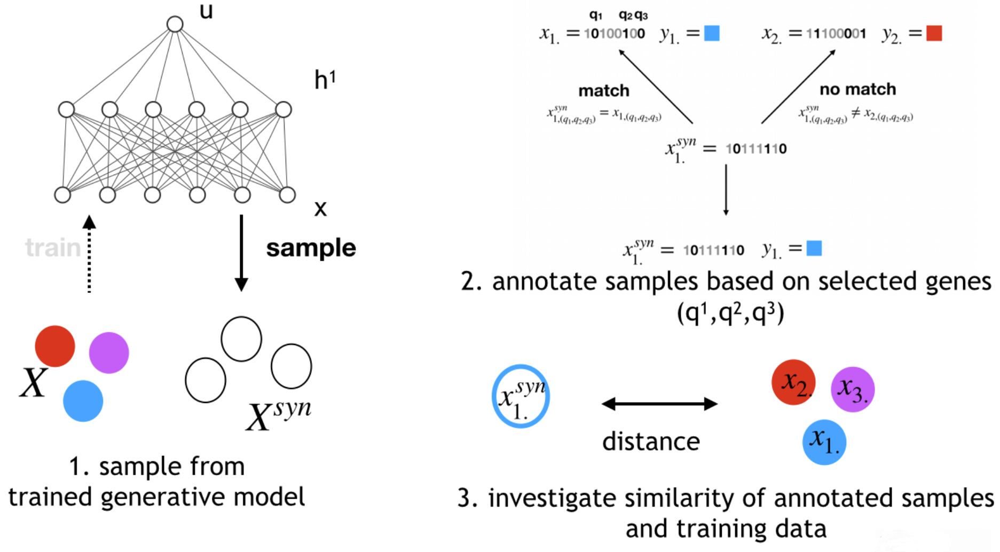

# Interpretable and accessible Deep Learning for omics data with R and friends
Moritz Hess, Stefan Lenz, Harald Binder

Institute of Medical Biometry and Statistics
Faculty of Medicine and Medical Center - University of Freiburg

## About

Jupyter notebook for the talk "Interpretable and accessible Deep Learning for omics data with R and friends" presented at eRUM 2020.
Tested under Julia 1.4.2 and R 4.0.1 running on Ubuntu 18.04.3 LTS.

Here we perform the analyses as presented in our talk at the eRUM. Our aim is:

1. to show how generative deep generative models in combination with log-linear models can be employed to extract meaningful patterns from single cell (sc) RNA-Seq data

2. to demonstrate the ease with which algorithms implemented in the programming language [Julia](julialang.org) can be leveraged for accessible deep learning applications in R.

Specifically [deep Boltzmann machines (DBMs)](http://www.cs.toronto.edu/~fritz/absps/dbm.pdf), which are deep generative models, are employed for learning the joint distribution of the observed variables (the genes; $x$) and latent variables (in $u$ and $h_{1}$), capturing non-linear dependencies in the data ($X$). 

This joint distribution is then investigated with log-linear models to infer joint patterns between the states of a subset of the latent variables ($U^{syn}$) and observed variables ($X^{syn}$), sampled from a trained DBM (examples for $U^{syn}$ and $X^{syn}$ are shown on the right-hand of the figure).

The software to train DBMs [BoltzmannMachines.jl](https://github.com/stefan-m-lenz/BoltzmannMachines.jl) and to fit log-linear models was implemented in Julia for [speed reasons](https://julialang.org/benchmarks/). The [JuliaConnectorR](https://github.com/stefan-m-lenz/JuliaConnectoR) is employed for rendering the above stated functionalities accessible in R.  

## Workflow

### 1. Loading and processing the data

We load the expression data using R. We use publically available scRNA-Seq data, published by Tasic et al. (2016).

### 2. Extract information carrying genes with deep Boltzmann machines and log-linear models using Julia and the JuliaConnectoR
We employ deep-learning techniques and techniques to extract information from trained models. Specifically, we employ deep generative methods, such as DBMs which learn the joint distribution in the data. I.e. we are dealing with unsupervised techniques. From a trained DBM we generate synthetic data for observed and latent variables. Based on joint patterns between latent variables and observed variables, we infer the information carrying observed variables. All employed methods are implemented in Julia for sake of speed. To employ these in R, we employ the [JuliaConnectoR](https://cran.r-project.org/web/packages/JuliaConnectoR/index.html), written by [Stefan Lenz](https://github.com/stefan-m-lenz).

### 3. Annotate synthetic observations by training data using the selected genes.
Since the selected genes should contain the essential information in the dataset with respect to cell populations, we should be able to annotate synthetic cells, generated by the DBM, based on patterns in the selected variables. We perform this operation completely in R.

